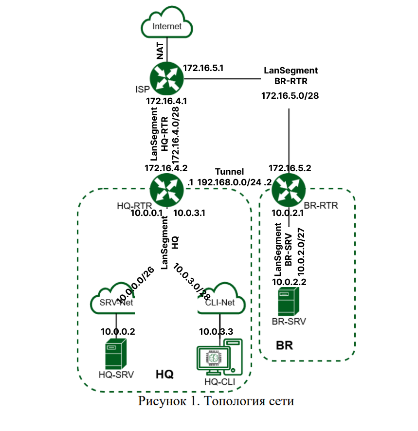

tags: [[demo]]
## Начало
### Топология

<p align="center">
  
</p>
### Таблица адресации

| Имя устройства      | inerface  | IPv4                               | Сегмент            |
| ------------------- | --------- | ---------------------------------- | ------------------ |
| isp.au-team.irpo    | ens33     | NAT                                | NAT                |
|                     |           | 172.16.4.1/28 255.255.255.0        | HQ-RTR             |
|                     |           | 172.16.5.1/28 255.255.255.0        | BR-RTR             |
| hq-rtr.au-team.irpo |           | 172.16.4.2/28 255.255.255.240      | HQ-RTR             |
|                     | ens37     | 10.0.0.1/26 255.255.255.192        | HQ                 |
|                     |           | 10.0.3.1/28 255.255.255.240        | HQ                 |
|                     | ens37.100 | 10.0.0.10/26 255.255.255.192       | не сегмент, а vlan |
|                     | ens38.200 | 10.0.3.2/28 255.255.255.240        | не сегмент, а vlan |
| hq-srv.au-team.irpo |           | 10.0.0.2/26 255.255.255.192        | HQ                 |
| br-rtr.au-team.irpo |           | 172.16.5.2/28 255.255.255.224      | BR-RTR             |
|                     |           | 10.0.2.1/27 255.255.255.240        | BR-SRV             |
| br-srv.au-team.irpo |           | 10.0.2.2/27 255.255.255.240        | BR-SRV             |
| hq-cli.au-team.irpo |           | 10.0.0.22/28 255.255.255.240(DHCP) | HQ                 |
|                     |           |                                    |                    |

### Необходимые пакеты для установки
**Установите пакеты пока у вас на всех машинах рабочий NAT!**
<br>
перед установкой желательно выполнить apt-get update

| Устройство | Пакеты                                                                                         |
| ---------- | ---------------------------------------------------------------------------------------------- |
| ISP        | `apt-get install network-manager ufw frr ssh -y`                                               |
| HQ-RTR     | `apt-get install network-manager sudo ufw ssh frr isc-dhcp-server chrony nginx vlan -y`        |
| HQ-SRV     | `apt-get install openssh-server ssh bind9 bind9-utils chrony nfs-server prometheus rsyslog -y` |
| HQ-CLI     | `apt-get install chrony ssh nfs-client cups-client -y`                                         |
| BR-RTR     | `apt-get install network-manager sudo ssh ufw frr chrony -y`                                   |
| BR-SRV     | `apt-get install openssh-server ssh chrony docker docker-compose docker-doc ansible samba -y`  |

## ✔️ 1.1
### Произведите базовую настройку устройств
Добавляем лан-сегменты согласно таблице 
**При этом первый сетевой адаптер мы не удаляем!**

1.1 Произведите базовую настройку устройств. 
P.S. чтобы настройки вступили в силу необходимо деактивировать/активировать соединение в nmtui. Если `device strictly unmanaged` нужно удалить упоминание(либо просто закомментировать) этого интерфейса в `/etc/network/interfaces`.
P.S Чтобы убрать баг, в котором у вас одно соединение(connection) предлагается для нескольких интерфейсов, нужно в поле device четко прописать имя интерфейса(mac адрес необязательно)


Обязательно лан-адаптеры ставим в режим Manual и ставим галочку в одном из пунктов

Также на забыть в `/etc/sysctl.conf` поставить `net.ipv4.ip_forward = 1`

## ✔️ Задание 1.2

### Настройка ISP
**На HQ-RTR и BR-RTR крайне желательно тоже сразу правильно настроить ufw**
*Все остальные пункты по сути сделали в первом задании*
  - На ISP настройте динамическую сетевую трансляцию в сторону HQ-RTR и BR-RTR для доступа к сети Интернет
  Для начала на всякий случай сбросим все настройки ufw
```bash
ufw reset  
```

И исходящие
```bash
ufw default allow outgoing
```

Затем открываем файл настроек ufw
```bash
nano /etc/ufw/before.rules
```
 и над блоком filter пишем
```bash
*nat
:PREROUTING ACCEPT [0:0]
:INPUT ACCEPT [0:0]
:OUTPUT ACCEPT [0:0]
:POSTROUTING ACCEPT [0:0]

# Port Forwardings
-A POSTROUTING -o ens33 -j MASQUERADE

COMMIT
```
Где,
- nat - таблица nat трансляций, где мы разрешаем прохождение всех видов трафика
- командой ниже мы устраиваем маскарад пакетам, проходящим через ens33(натовский) интерфейс

Затем перезапускаем 
```bash
ufw disable
ufw enable
```
## ✔️ Задание 1.3
**Создание локальных учетных записей**

**Нужно установить sudo**
Создаем пользователя с домашней директорией и uid 1010
```bash
sudo useradd -s /bin/bash -m -u 1010 -G sudo sshuser
```
Далее необходимо задать пользователю пароль
`passwd sshuser`
Указываем `P@ssw0rd`

Добавляем следующую строку`/etc/sudoers`:
```bash
sshuser ALL=(ALL) NOPASSWD:ALL
```

Позволяет запускать **sudo** без аутентификации 

Аналогично net_admin на HQ-RTR и BR-RTR
```bash
sudo useradd -s /bin/bash -m -G sudo net_admin
```
Далее необходимо задать пользователю пароль
`passwd net_admin`
Указываем `P@$$w0rd`
Также добавляем в файл sudoers
## ✔️ Задание 1.4 - VLAN

Можно ознакомиться вот здесь https://github.com/Flicks1383/Demo2025_debian/tree/main/Module1#%EF%B8%8F-%D0%B7%D0%B0%D0%B4%D0%B0%D0%BD%D0%B8%D0%B5-4

в nmtui просто добавляем 2 vlan интерфейса
добавление интерфейса для vlan 100


добавление интерфейса для vlan 200


## ✔️ Задание 5

### Настройка безопасного удаленного доступа на серверах HQ-SRV и BR-SRV

```bash
nano /etc/ssh/sshd_config
```
Далее раскомментируем либо просто пишем: 
```bash
Port 2024
AllowUsers sshuser
PermitRootLogin no
MaxAuthTries 2
Banner /etc/ssh/banner 
```
(предварительно разумеется надо создать и написать содержимое баннера)

Далее необходимо перезапустить **`SSH`** коммандой:
  
```bash
systemctl restart sshd
```
Далее для подключения с пингующейся машины по ssh нужно ввести:
```bash
ssh sshuser@10.0.0.2 -p 2024
```

## ✔️ Задание 6

### Между офисами HQ и BR необходимо сконфигурировать IP-туннель

> [!WARNING]
> **Не используйте** устройства с именем **`tun0`, `gre0` и `sit0`**, т.к они являются зарезервированными в iproute2 («base devices») и имеют особое поведение.


- Сведения о туннеле занесите в отчёт  
- На выбор технологии GRE или IP in IP
Туннель на HQ-RTR

Туннель на BR-RTR

Изменяем время жизни пакета, якобы для правильной работы OSPF

```bash
nmcli connection modify tun1 ip-tunnel.ttl 64
```
## ✔️ Задание 7

### Обеспечьте динамическую маршрутизацию: ресурсы одного офиса должны быть доступны из другого офиса. Для обеспечения динамической маршрутизации используйте `link state` протокол на ваше усмотрение

- Разрешите выбранный протокол только на интерфейсах в ip туннеле  
- Маршрутизаторы должны делиться маршрутами только друг с другом  
- Обеспечьте защиту выбранного протокола посредством парольной защиты  
- Сведения о настройке и защите протокола занесите в отчёт

Настройка `OSPF` производится HQ-RTR и BR-RTR:
### HQ-RTR

**1.** Устанавливаем пакет `FRR`

```bash
sudo apt install -y frr
```

**2.** В конфигурационном файле `/etc/frr/daemons` необходимо активировать выбранный протокол `OSPF` для дальнейшей реализации его настройки:

```bash
nano /etc/frr/daemons

!!! Ищем следующую строку и меняем с (no) на (yes)
ospfd = yes
```

**3.** Далее включаем и добавляем в автозагрузку службу **`FRR`**

```bash
systemctl enable --now frr
```

**4.** Переходим в интерфейс управления симуляцией **`FRR`** командой:
```
vtysh
```

**5.** Редактируем файл frr.conf:
 
```bash
!
router ospf
  passive-interface default
  router-id 1.1.1.1
  network 172.16.4.0/28 area 0
  network 10.0.0.0/26 area 0
  network 10.0.3.0/28 area 0
  area 0 authentication
  exit

int tun1
  no ip ospf network broadcast
  no ip ospf passive
  ip ospf authentication
  ip ospf authentication-key password
  exit
!
```

### BR-RTR

**1-4.** Пункты такие же как и в HQ-RTR

**5.** Редактируем файл frr.conf:

```
!
router ospf 1
  passive-interface default
  router-id 2.2.2.2
  network 172.16.5.0/28 area 0
  network 10.0.2.0/27 area 0
  area 0 authentication
  exit

int tun1
  no ip ospf network broadcast
  no ip ospf passive
  ip ospf authentication
  ip ospf authentication-key password
  exit
!
```

### ПРОВЕРКА

Пингуем: **`BR-SRV - > HQ-SRV`** и **`BR-SRV - > HQ-CLI`**

Проверка в **FRR**:

```
vtysh
  show ip ospf neighbor
  show ip route ospf
```
На этом этапе если у вас что то не пингуется, то желательно бросить настройку этого frr и просто пробросить статические маршруты через nmtui на **ISP** примерно следующим образом:
<br/>
На интерфейсе смотрящем на HQ-RTR(172.16.4.1)
```shell
network          next-hop
10.0.0.0/26      172.16.4.2 
10.0.3.0/28      172.16.4.2
```
На интерфейсе смотрящем на BR-RTR(172.16.4.2)
```shell
network          next-hop
10.0.2.0/27      172.16.5.2 
```
Также на всякий случай можно пробросить маршруты на 
<br/>
HQ-RTR на интерфейсе смотрящем на ISP(172.16.4.2)
```shell
network          next-hop
10.0.2.0/27      172.16.4.1 
```
BR-RTR на интерфейсе смотрящем на ISP(172.16.5.2)
```shell
network          next-hop
10.0.0.0/26      172.16.5.1 
10.0.3.0/28      172.16.5.1 
```
И затем перезагрузить все машины и молиться
## ✔️ Задание 8

Настройка динамической трансляции адресов
- Настройте динамическую трансляцию адресов для обоих офисов.  
- Все устройства в офисах должны иметь доступ к сети Интернет

Настройка на `ISP выполнена` в Задании 2. Сейчас я буду ссылаться на нее
### Настройка динамической сетевой трансляции на `HQ-RTR`
В том же блоке nat указываем
```
# Port Forwardings
–A POSTROUTING –s 10.0.0.0/26 –o ens37 –j MASQUERADE
–A POSTROUTING –s 10.0.3.0/28 –o ens37 –j MASQUERADE  
```
Не забываем про волшебные 4 строчки, которые разрешают прохождение всему трафику
### Настройка динамической сетевой трансляции на `BR-RTR`

```
# Port Forwardings
–A POSTROUTING –s 10.0.2.0/27 –o ens37 –j MASQUERADE  
```

Также не забываем про волшебные 4 строчки, которые разрешают прохождение всему трафику
## ✔️ Задание 9

### Настройка протокола динамической конфигурации хостов

Настройка динамической конфигурации хостов

**1.** Устанавливаем сам **DHCP-сервер**:  
```bash
apt install isc-dhcp-server
```

**2.** После чего переходим в конфигурацию файла `/etc/dhcp/dhcpd.conf` и добавляем следующие строчки:
```bash
option domain-name "hq-rtr.au-team.irpo";
option domain-name-servers 10.0.0.2, 192.168.132.2;

default-lease-time 6000;
max-lease-time 72000;

subnet 10.0.3.0 netmask 255.255.255.240 {
  range 10.0.3.3 10.0.3.3;
  option routers 10.0.3.1;
}
```

**3.** После чего переходим в конфигурацию файла `/etc/default/isc-dhcp-server` и меняем ее добавляя данный текст:
```bash
INTERFACESv4="ens38" - порт смотрящий в сторону CLI
```

**4.** Включаем сервиc **`DHCP`** и добавим в автозагрузку на **`HQ-RTR`**:
```bash
systemctl start isc-dhcp-server
systemctl enable isc-dhcp-server
```

**5.** Далее на клиентской машине необходимо в настройках адаптера выбрать **DHCP** и проверить работоспособность

## ✔️ Задание 10

### Настройка DNS для офисов HQ и BR  
- Основной DNS-сервер реализован на HQ-SRV.  
- Сервер должен обеспечивать разрешение имён в сетевые адреса устройств и обратно в соответствии с таблицей 2  
- В качестве DNS сервера пересылки используйте любой общедоступный DNS сервер  

<table align="center">
  <tr>
    <td align="center">Устройство</td>
    <td align="center">Запись</td>
    <td align="center">Тип</td>
  </tr>
  <tr>
    <td align="center">HQ-RTR</td>
    <td align="center">hq-rtr.au-team.irpo</td>
    <td align="center">A,PTR</td>
  </tr>
  <tr>
    <td align="center">BR-RTR</td>
    <td align="center">br-rtr.au-team.irpo</td>
    <td align="center">A</td>
  </tr>
  <tr>
    <td align="center">HQ-SRV</td>
    <td align="center">hq-srv.au-team.irpo</td>
    <td align="center">A,PTR</td>
  </tr>
  <tr>
    <td align="center">HQ-CLI</td>
    <td align="center">hq-cli.au-team.irpo</td>
    <td align="center">A,PTR</td>
  </tr>
  <tr>
    <td align="center">BR-SRV</td>
    <td align="center">br-srv.au-team.irpo</td>
    <td align="center">A</td>
  </tr>
  <tr>
    <td align="center">HQ-RTR</td>
    <td align="center">moodle.au-team.irpo</td>
    <td align="center">CNAME</td>
  </tr>
  <tr>
    <td align="center">BR-RTR</td>
    <td align="center">wiki.au-team.irpo</td>
    <td align="center">CNAME</td>
  </tr>
</table>


Настройка DNS
### Основной DNS-сервер реализован на `HQ-SRV`

### HQ-SRV

**1.** Для работы с **DNS** требуется установить **`bind`** и доп. пакет командой:

```
apt-get install bind9 bind9-utils
```

**2.** Далее необходимо сконфигурировать файл **`/etc/bind/named.conf.option`** таким образом:

```
acl my_net {
        172.16.5.0/28;
        172.16.4.0/28;
        192.168.0.0/24;
        10.0.2.0/27;
        10.0.0.0/26;
        10.0.3.0/28;
};
options {

        directory "/var/cache/bind";
        recursion yes;
        allow-recursion { my_net; };
        
	    forwarders {
                8.8.8.8;
         };
    };
```

**3.** Далее требуется изменить конфигурацию файла **`/etc/resolv.conf`**:

```bash
search au-team.irpo
nameserver 10.0.0.2
search localdomain
nameserver 192.168.132.2
```

**4.** После чего требуется прописать в **`/etc/bind/named.conf.local`**:

```bash
zone "au-team.irpo" {
        type master;
        file "/etc/bind/zones/db.au-team.irpo";
};

zone "0.0.10.in-addr.arpa" {
        type master;
        file "/etc/bind/zones/db.10";
};

zone "3.0.10.in-addr.arpa" {
        type master;
        file "/etc/bind/zones/db.10.3";
};
```


**5.** Далее следующими командами **создаём копию** файла и присваиваем права:

```bash
cp /etc/bind/db.local /etc/bind/zones/db.au-team.irpo
```


**6.** После чего приводим **файл `/etc/bind/zones/db.au-team.irpo`** к следующему виду:

```bash
$TTL    86400
@       IN      SOA     au-team.irpo. root.au-team.irpo. (
                              2         ; Serial
                         604800         ; Refresh
                          86400         ; Retry
                        2419200         ; Expire
                          86400 )       ; Negative Cache TTL
;
@       IN      NS      au-team.irpo.
@       IN      A       10.0.0.2
hq-srv.au-team.irpo.    IN      A       10.0.0.2
hq-rtr.au-team.irpo.    IN      A       10.0.0.1
hq-cli.au-team.irpo.    IN      A       10.0.3.3
br-rtr.au-team.irpo.    IN      A       10.0.2.1
br-srv.au-team.irpo.    IN      A       10.0.2.2
moodle.au-team.irpo.    IN      CNAME   hq-rtr.au-team.irpo.
wiki.au-team.irpo.      IN      CNAME   hq-rtr.au-team.irpo.
```

**7.** После чего **создаем файлы** командами:
```bash
cp /etc/bind/db.127 /etc/bind/zones/db.10
cp /etc/bind/db.127 /etc/bind/zones/db.10.3
```

**8.** После изменений файл **`db.10`** выглядит так:
```bash
$TTL    604800
@       IN      SOA     au-team.irpo. root.au-team.irpo. (
                              2         ; Serial
                         604800         ; Refresh
                          86400         ; Retry
                        2419200         ; Expire
                         604800 )       ; Negative Cache TTL
;
@       IN      NS      au-team.irpo.
1       IN      PTR     hq-rtr.au-team.irpo.
2       IN      PTR     hq-srv.au-team.irpo.
```


**9.** После изменений файл **`db.10.3`** выглядит так:
```bash
$TTL    604800
@       IN      SOA     au-team.irpo. root.au-team.irpo. (
                              2         ; Serial
                         604800         ; Refresh
                          86400         ; Retry
                        2419200         ; Expire
                         604800 )       ; Negative Cache TTL
;
@       IN      NS      au-team.irpo.
3       IN      PTR     hq-cli.au-team.irpo.
```
### ❗ ❗ ❗ Все пробелы выше ^ ставятся TAB'ом


**10.** После чего можно проверить **ошибки** командой:
```bash
named-checkconf -z
```

**11.** А также перезапускаем **`bind`** командой:

```bash
systemctl restart named bind9
```

**12.** Проверить работоспособность можно **командой**:
```
nslookup **IP-адрес/DNS-имя**
```


## ✔️ Задание 11

### Настройте часовой пояс на всех устройствах, согласно месту проведения экзамена

- На Linux настраивается часовой пояс командой
```
timedatectl set-timezone Europe/Moscow
```
