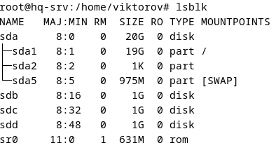
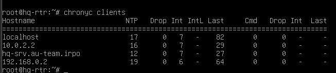
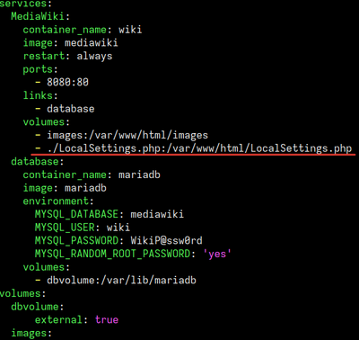
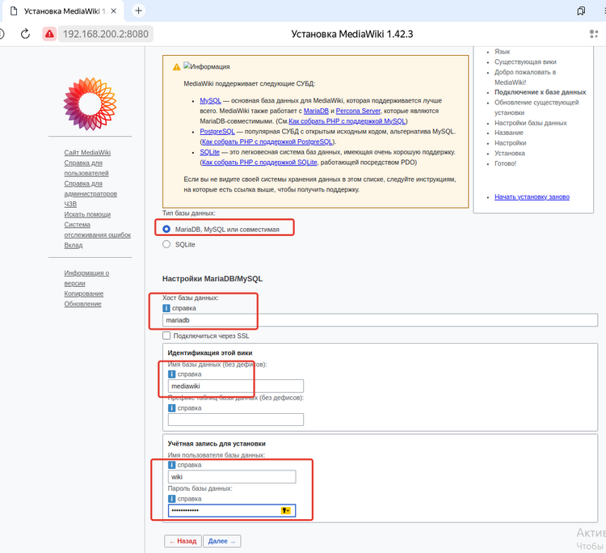
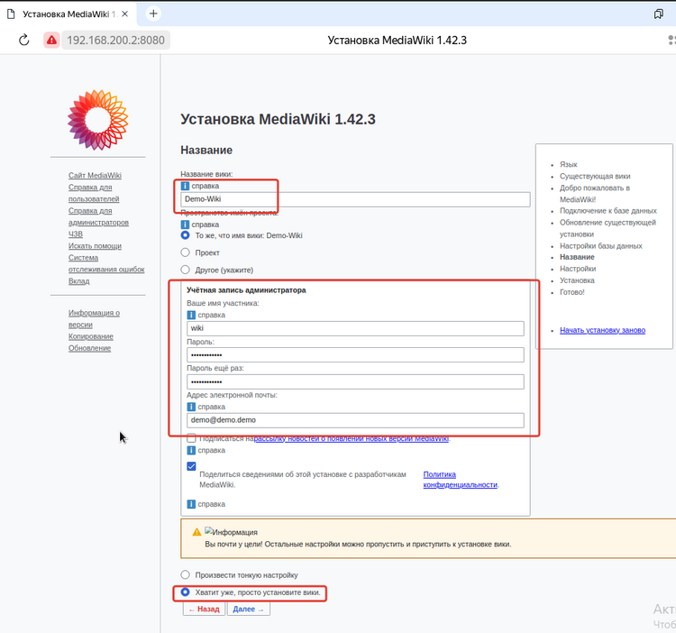

tags: [[demo]]
## ✔️ Задание 2

### Сконфигурируйте файловое хранилище

>[!WARNING]
>#### Перед началом настройки создайте снапшот устройства!!!

Подключаем новые виртуальные диски в интерфейсе VMware - 3шт по 1 гб
Командой `lsblk` выводим список накопителей, должны быть видны кенты по 1 гб


При необходимости перезагружаем машину
Шаблон команды настройки массива для наглядности
```bash
mdadm --create /dev/<название массива> --level=<Версия RAID> --raid-devices=<Количество устройств для массива> /dev/<Диск 1> ... /dev/<Диск n>
```

В нашем случае команда имеет вид
```bash
/sbin/mdadm --create /dev/md0 --level=5 --raid-devices=3 /dev/sdb /dev/sdc /dev/sdd
```

Создайте раздел, отформатируйте раздел, в качестве файловой системы используйте ext4
```bash
sudo mkfs -t ext4 /dev/md0
```

Имя устройства – md0, конфигурация массива размещается в файле /etc/mdadm.conf
```bash
/sbin/mdadm --detail --scan >> /etc/mdadm.conf
```

Обеспечьте автоматическое монтирование в папку /raid5 
```bash
mkdir /mnt/raid5
```

в файле /etc/fstab пишем(пробелы это tab)
```bash
/dev/md0        /mnt/raid5      ext4    defaults        0       0
```

перезагружаем демона
```bash
systemctl daemon-reload
```

Монтируем все диски указанные в fstab
```bash
mount -a
```

Проверяем монтирование командой 
```bash
df -h
```

Результатом вывода путь будет /mnt/raid5

<p align="center">
  
</p>

Настройте сервер сетевой файловой системы(nfs), в качестве папки общего доступа выберите /raid5/nfs, доступ для чтения и записи для всей сети в сторону HQ-CLI - пока нет

### Настраиваем на HQ-SRV:

**1.** Устанавливаем **утилиты:**

```bash
apt-get install -y nfs-server
```

**2.** **Создаем директорию** командой:

```bash
mkdir /mnt/raid5/nfs
```

**3.** Задаем **права директории**:

```bash
chmod 777 /mnt/raid5/nfs
```

**4.** В файл **`/etc/exports`** добавляем строку(ip нашего HQ-CLI):

```bash
echo "/mnt/raid5/nfs 10.0.3.0/28(rw,sync,no_subtree_check,no_root_squash)" > /etc/exports
```

**5.** **Экспорт** файловой системы:

```bash
exportfs -arv
```

**6.** Запускаем **NFS сервер** командой:

```bash
systemctl enable --now nfs-server
```

Если после перезагрузки сервера вас встречает аварийный терминал, то вам нужно выполнить команду
```
lsblk
```
чтобы узнать номер смонтированного диска(допустим md127). Нужно запомнить этот номер и записать его вместо 0 в `/etc/fstab`. После перезагрузки hq srv должен нормально работать

### Настраиваем на HQ_CLI:
**1.** Устанавливаем NFS клиент:

```bash
apt-get install -y nfs-client
```

**2.** Создаем директорию командой:

```bash
mkdir /mnt/nfs
```

**3.** После задаем права:

```bash
chmod 777 /mnt/nfs
```

**4.** Добавляем в файл `/etc/fstab` строку:

```bash
10.0.0.2:/mnt/raid5/nfs  /mnt/nfs  nfs  defaults  0  0

ВСЕ ПРОБЕЛЫ СДЕЛАНЫ TAB`ом
```

**5.** Далее монтируем ресурс командой и перезагружаем демона:

```bash
mount -a
systemctl daemon-reload
```

❗ После можно проверить монтирование командой:

```bash
df -h
```
## ✔️ Задание 3

### Настройте службу сетевого времени на базе сервиса chrony

- В качества сервера выступает HQ-RTR

- На HQ-RTR настройте сервер chrony, выберите стратум 5

- В качестве клиентов настройте HQ-SRV, HQ-CLI, BR-RTR, BR-SRV


**1.** Устанавливаем `chrony` на **HQ-RTR** командой:
```bash
sudo apt install chrony
```


**2.** Далее редактируем конфигурационный файл **`sudo nano /etc/chrony/chrony.conf`**

```bash
#server ntp4.uniiftri.ru iburst <- ПОДОБНЫЕ ЗАПИСИ КОММЕНТИРУЕМ!!!

/// ДОПИСЫВАЕМ ВСЁ ЧТО СНИЗУ ///

server 127.0.0.1 iburst prefer
local stratum 5
allow 0/0
```

`server` - машина выступающая на роль сервера chrony;

`iburst` - отправка нескольких пакетов (для точности);

`perfer` - указывает на предпочитаемый сервер;

`local stratum 5` - установка 5 уровня на локальный сервер;

`allow` - устройства с каких подсетей имеют возможность синхронизироваться с сервером;


**3.** После установки, **перезагружаем сервис** и **добавляем в автозагрузку**:
```bash
systemctl restart chrony

systemctl enable --now  chrony
```


Настройка на HQ-SRV HQ-CLI BR-RTR BR-SRV(на всех аналогично):
Устанавливаем chrony:

```bash
apt install chrony
```

Далее редактируем конфигурационный файл 
```bash
sudo nano /etc/chrony/chrony.conf
```
Прописываем наш сервер:
```bash
server 10.0.0.1 iburst prefer
# И комментируем строчку: 
#pool 2.debian.pool.ntp.org iburst
```

После перезагружаем сервис и добавляем в автозагрузку:
```bash
systemctl restart chrony
systemctl enable --now  chrony
```

Проверка на роутере:
```bash
chronyc clients
```
	


Проверка на клиенте:
```bash
chronyc sources
```
	


## ✔️ Задание 4

### Сконфигурируйте ansible на сервере BR-SRV

- Сформируйте файл инвентаря, в инвентарь должны входить HQ-SRV, HQ-CLI, HQ-RTR и BR-RTR
- Рабочий каталог ansible должен располагаться в /etc/ansible
- Все указанные машины должны без предупреждений и ошибок отвечать pong на команду ping в ansible посланную с BR-SRV
## Настройка ansible производится на `BR-SRV`

**1.** Для начала устанавливаем "Ansible" командой:
```bash
apt-get install ansible -y
```

**2.** Создаём пары SSH-ключей следующей командой:

```bash
ssh-keygen -t rsa
```
- По итогу создания ключей в каталоге пользователя под которым сидим `sshuser` или же `root`, появятся ключи:
  
  - `/home/sshuser/.ssh` - Если зашли за **sshuser**

  - `/root/.ssh` - Если зашли за **root**

>Смотрим каталог с ключами:
>```
>ls -l ~/.ssh
>
>id_rsa  # закрытый ключ
>id_rsa.pub # открытый ключ
>

**3.** Заходим под пользователя **`sshuser`**:
```bash
su sshuser
```

**4.** Копируем открытый **`SSH-ключ`** на удаленные устройства под пользователем **`sshuser`**:

- Копируем ключ для пользователя **sshuser** на **`HQ-SRV`**
  - На HQ-SRV ssh порт изменен, указываем его:
```bash
ssh-copy-id -p 2024 sshuser@10.0.0.2
```

- Копируем ключ для пользователя **user** на **`HQ-CLI`**
```bash
ssh-copy-id user@10.0.3.3
```

- Копируем ключ для пользователя **net_admin** на **`HQ-RTR`**
```bash
ssh-copy-id net_admin@172.16.4.2
```

- Копируем ключ для пользователя **net_admin** на **`BR-RTR`**
```bash
ssh-copy-id net_admin@172.16.5.2
```

### Готовим файл инвентаря (hosts)

**1.** Создаем файл инвентаря **`/etc/ansible/demo`**
```bash
nano /etc/ansible/demo
```

**2.** Приводим **файл** в следующий вид:

```bash
[hq]
10.0.0.2 ansible_port=2024 ansible_user=sshuser
10.0.3.3 ansible_user=viktorov
172.16.4.2 ansible_user=net_admin

[br]
172.16.5.2 ansible_user=net_admin
```

**где:**
- `ansible_port` - Номер порта ssh, если не 22
- `ansible_user` - Использовать имя пользователя ssh по умолчанию.

### Запуск команд с пользовательским инвентарем (ping-pong)

**1.** Что бы запустить модуль ping на всех хостах, перечисленных файле инвентаря **`/etc/ansible/demo`** пишем следующую команду:

```bash
ansible all -i /etc/ansible/demo -m ping
```

**!!! Может появиться предупреждение про обнаружение интерпретатора Python, на целевом хосте**


**2.** Для управления поведением обнаружения в глобальном масштабе необходимо в файле конфигурации **`ansible /etc/ansible/ansible.cfg`** в разделе **`[defaults]`** прописать ключ **`interpreter_python`** с параметром **`auto_silent`**. В большинстве дистрибутивов прописываем вручную.

```bash
nano /etc/ansible/ansible.cfg

[defaults]
interpreter_python=auto_silent
```


**3.** Запускаем команду `ping` на всех хостах:
```bash
ansible all -i /etc/ansible/demo -m ping
```


## ✔️ Задание 5

### Развертывание приложений в Docker на сервере BR-SRV

- Создайте в домашней директории пользователя файл wiki.yml для приложения MediaWiki
- Средствами docker compose должен создаваться стек контейнеров с приложением MediaWiki и базой данных
- Используйте два сервиса
- Основной контейнер MediaWiki должен называться wiki и использовать образ mediawiki
- Файл LocalSettings.php с корректными настройками должен находиться в домашней папке пользователя и автоматически монтироваться в образ
- Контейнер с базой данных должен называться mariadb и использовать образ mariadb
- Разверните
- Он должен создавать базу с названием mediawiki, доступную по стандартному порту, пользователя wiki с паролем WikiP@ssw0rd должен иметь права доступа к этой базе данных
- MediaWiki должна быть доступна извне через порт 8080


### Установка Wiki (на BR-SRV)

От sshuser
**2.** Обновляем пакеты и устанавливаем **Docker**:
```shell
sudo apt update

sudo apt install docker docker-compose docker-doc
```

**3.**  Добавляем **Docker** в автозагрузку и запускаем:
```shell
systemctl enable docker --now
```

**4.** Проверяем статус запущенной службы **(Docker)** и информацию:
```bash
systemctl status docker

docker info
```

**5.**  При помощи `CLI` заходим в **YandexBrowser**:
копируем конфиг, отсюда https://www.mediawiki.org/wiki/Docker/Hub#Adding_a_Database_Server
**6.** В домашней директории пользователя root создаем композер-файл **wiki.yaml**:
```bash
nano wiki.yaml
```
**8.** Копируем и вставляем содержимое c сайта в **wiki.yml**:




**9.** Чтобы отдельный **volume** для хранения базы данных **имел правильное имя** - создаём его средствами **docker**:
```bash
sudo docker volume create dbvolume
```

**`Информация|Проверка.`** Посмотреть все тмеющиеся **volume** можно командой:
```bash
sudo docker volume ls
```

**10.** Выполняем сборку и запуск стека контейнеров с приложением **MediaWiki** и базой данных описанных в файле **wiki.yml**:
```bash
sudo docker-compose -f wiki.yaml up -d
```
### Настройка Wiki через WEB-интерфейс:

**1.** Переходим на `HQ-CLI` в браузере по адресу **http://10.0.2.2:8080** (айпишник BR-SRV:8080):
- Для продолжения установки через **WEB-интерфейс** - нажимаем **`set up the wiki`**
**2.** Выбираем необходимый Язык - жмем **Далее**, проходим проверку внешней среды и так-же нажимаем **далее**:
**3.** Заполняем параметры подключение к **БД** в соответствие с заданными переменными окружения в **wiki.yml**, которые соответствуют заданию:



**4.** Ставим галочку и жмем **Далее**:
**5.** Вносим необхоимые изменения, ставим галочку и жмём **Далее**:



**6.** Будет автоматически скачен файл **`LocalSettings.php`** - который необходимо передать в директорию **`/home/sshuser`** туда же где лежит **`wiki.yaml`**:
```bash
mv /home/sshuser/Загрузки/LocalSettings.php /home/sshuser/
```
**7.** Раскомментируем строку в файле **`wiki.yaml`** :
```bash
nano /home/sshuser/wiki.yaml
```


**8.** Перезапускаем сервисы средствами **`docker-compose`**:
```bash
docker-compose -f wiki.yaml stop
docker-compose -f wiki.yaml up -d
```

**9.** Проверяем доступ к Wiki **`http://10.0.2.2:8080`**

Входим под

- `Пользователь`: wiki 

- `Пароль`: WikiP@ssw0rd

## ✔️ Задание 6

### На маршрутизаторах сконфигурируйте статическую трансляцию портов

- Пробросьте порт 80 в порт 8080 на BR-SRV на маршрутизаторе BR-RTR, для обеспечения работы сервиса wiki
- Пробросьте порт 2024 в порт 2024 на HQ-SRV на маршрутизаторе HQ-RTR
- Пробросьте порт 2024 в порт 2024 на BR-SRV на маршрутизаторе BR-RTR

### BR-RTR

**1.** Проброс **80** порта и **2024** для BR-SRV

в `etc/ufw/before.rules` в блоке nat пишем

```bash
#to br-srv
-A PREROUTING -p tcp --dport 80 -j DNAT --to-destination 10.0.2.2:8080
#to br-srv              
-A PREROUTING -p tcp --dport 2024 -j DNAT --to-destination 10.0.2.2:2024
```


И на
### HQ-RTR

**2.** Проброс порта **2024** для HQ-SRV
```bash
#2024 to hq-srv
-A PREROUTING -p tcp --dport 2024 -j DNAT --to-destination 10.0.0.2:2024
```


## ✔️ Задание 7

### Запустите сервис moodle на сервере HQ-SRV:

  - Используйте веб-сервер apache
  - В качестве системы управления базами данных используйте mariadb
  - Создайте базу данных moodledb
  - Создайте пользователя moodle с паролем P@ssw0rd и предоставьте ему права доступа к этой базе данных
  - У пользователя admin в системе обучения задайте пароль P@ssw0rd
  - На главной странице должен отражаться номер рабочего места в виде арабской цифры, других подписей делать не надо
  - Основные параметры отметьте в отчёте

### HQ-SRV

**1.** Устанавливаем необходимые **пакеты**:
```bash
sudo apt update

sudo apt install -y apache2 mariadb-server mariadb-client php php-mysql libapache2-mod-php php-xml php-mbstring php-zip php-curl php-gd php-intl git
```

**2.** Запуcкаем **MariaDB**:
```shell
sudo systemctl start mariadb

sudo systemctl enable mariadb
```

**3.** Зайдите в консоль **MariaDB**:
```shell
sudo mysql -u root -p
```

**4.** **Создайте** базу данных и пользователя:
```sql
CREATE DATABASE moodledb;
CREATE USER 'moodle'@'localhost' IDENTIFIED BY 'P@ssw0rd';
GRANT ALL PRIVILEGES ON moodledb.* TO 'moodle'@'localhost';
FLUSH PRIVILEGES;
EXIT;
```

**5.** Перезапускаем MariaDB:
```shell
systemctl restart mariadb
```

### Установка *Moodle* через *Git*

### HQ-SRV

**5.** Заходим в директорию где будет установлен **moodle**
```shell
cd /var/www/html/
```
**6.** Клонируем репозиторий **Moodle**:
```shell
sudo git clone git://git.moodle.org/moodle.git
```
**7.** Переходим в директорию **Moodle**
```shell
cd moodle
```

**8.**  У нас вышло так:

```bash
git branch --track MOODLE_405_STABLE origin/MOODLE_405_STABLE
git checkout MOODLE_405_STABLE
```

**9.** Настройка директорий и прав:

```bash
sudo mkdir -p /var/www/moodledata
sudo chown -R www-data:www-data /var/www/moodledata
sudo chmod -R 770 /var/www/moodledata
sudo chown -R www-data:www-data /var/www/html/moodle
```

**10.** Создание файла конфигурации **Apache**
```bash
sudo nano /etc/apache2/sites-available/moodle.conf
```

**11.** Вставляем следующие настройки в эту конфигурацию:
```bash
<VirtualHost *:80>
    ServerAdmin admin@example.com
    DocumentRoot /var/www/html/moodle
    DirectoryIndex index.php
    <Directory /var/www/html/moodle>
        Options Indexes FollowSymLinks
        AllowOverride All
        Require all granted
    </Directory>
    ErrorLog ${APACHE_LOG_DIR}/moodle_error.log
    CustomLog ${APACHE_LOG_DIR}/moodle_access.log combined
</VirtualHost>
```

**12.** Активируем новый сайт и модули:
```bash
sudo a2ensite moodle.conf
sudo a2enmod rewrite
```

**13.** Перезапускаем **Apache**:
```bash
sudo systemctl restart apache2
```

### Настройка в Moodle в Web-интерфейсе

**1.** Откройте веб-браузер и перейдите по адресу http://10.0.0.2/moodle.
В процессе установки укажите данные для подключения к базе данных:

**`Название базы данных`**: moodledb

**`Пользователь`**: moodle

**`Пароль`**: P@ssw0rd


**2.** Перед установкой возможно нужно будет решить некоторые проблемы совместимости, например
у нас потребовало отредактировать файл `/etc/php/8.2/apache2/php.ini` следующим образом
```php
extension=php_intl.dll

[intl]
intl.default_locale=en_utf8
intl.error_level=E_WARNING

max_input_vars = 5000
```
 и затем обновить конфигурацию apache 
```bash
sudo systemctl reload apache2
```
И нажать кнопочку обновить внизу страницы установки(где перечисляются модули)

Сами мы это не придумали, ошибки заботливо ссылают на документацию. Читайте внимательно если че

Дальше включаем соображалку и заполняем поля желательно по заданию, на крайняк по наитию

## ✔️ Задание 8

### Настройте веб-сервер nginx как обратный прокси-сервер на HQ-RTR

- При обращении к HQ-RTR по доменному имени moodle.au-team.irpo клиента должно перенаправлять на HQ-SRV на стандартный порт, на сервис moodle

- При обращении к HQ-RTR по доменному имени wiki. au-team.irpo клиента должно перенаправлять на BR-SRV на порт, на сервис mediawiki


**1.** Установка **Nginx**:
```shell
sudo apt install nginx -y
```

**2.** Включаем автозагрузку службы:
```shell
systemctl enable --now nginx
```

**3.** Открываем на редактирование конфигурационный файл **`Nginx`**
```shell
nano nano /etc/nginx/nginx.conf
```

**4.** Cпускаемся в конец документа и перед последней фигурной скобкой **`}`** прописываем:
```bash
server  {
        listen 80;
        server_name moodle.au-team.irpo;

        location / {
            proxy_pass http://10.0.0.2:80/moodle;
        }
}

server {
        listen 80;
        server_name wiki.au-team.irpo;

        location / {
            proxy_pass http://10.0.2.2:8080;
        }
}
```

**5.** Перезагружаем **`Nginx`**
```shell
systemctl restart nginx
```
### ПРОВЕРКА

- На **`HQ-CLI`** в браузере заходим по доменному имени:

  на **`Moodle`** – http://moodle.au-team.irpo

  на **`MediaWiki`** – http://wiki.au-team.irpo

## ✔️ Задание 9

### Удобным способом установите приложение Яндекс Браузере для организаций на HQ-CLI

- Установку браузера отметьте в отчёте

На HQ-CLI перейти по ссылке и скачать zip архив deb пакета, распаковать архив и установить пакет

https://dzen.ru/a/ZjnhiZYO-nsIoVXD


